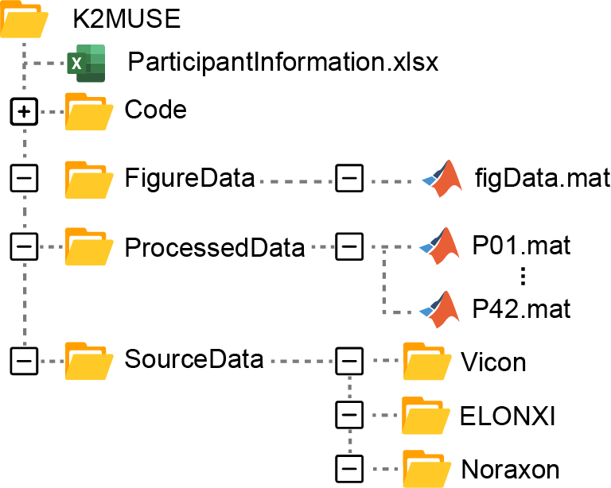
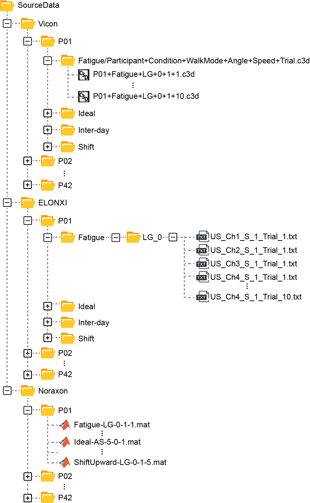
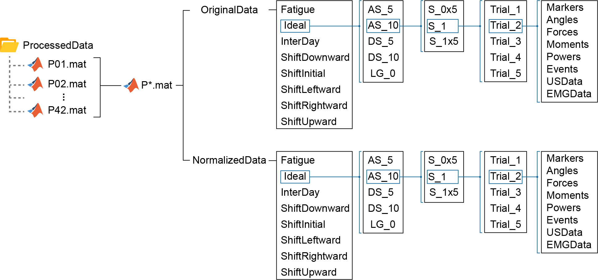
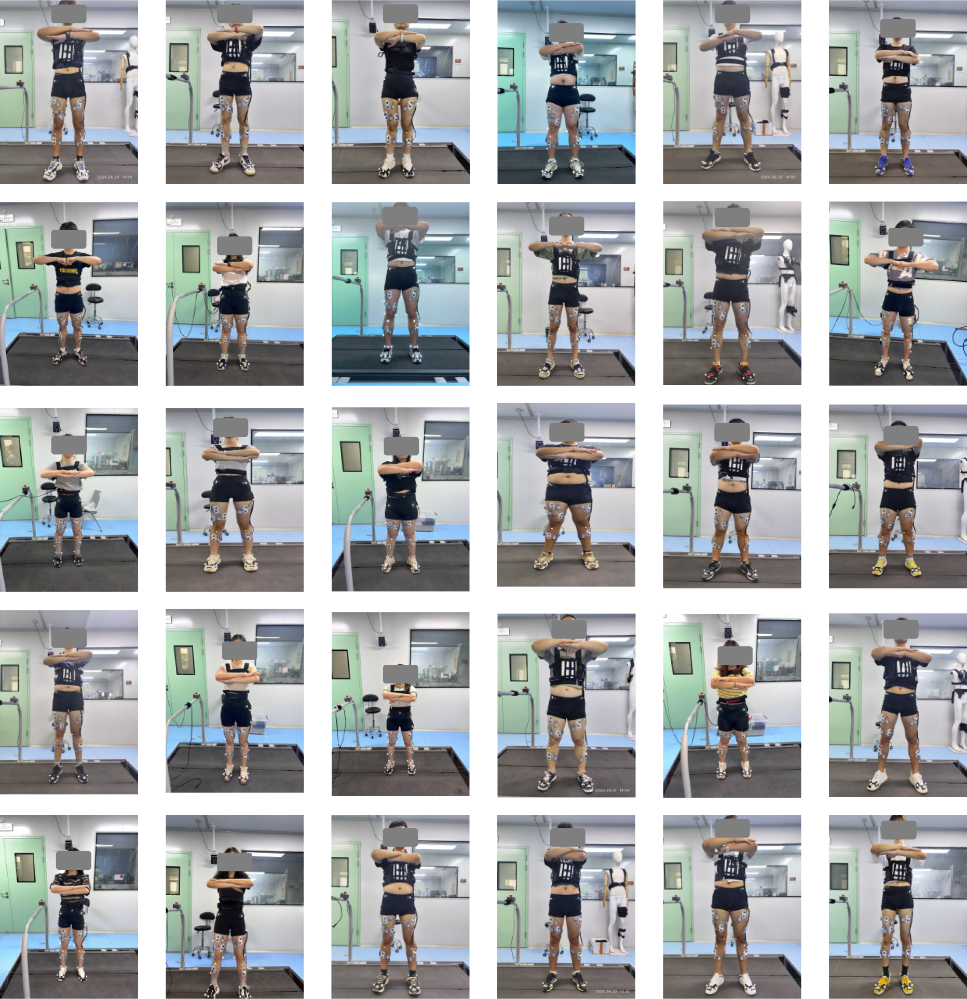

## Download K2MUSE

　　The complete dataset and related code have been uploaded to Kaggle. Please click the following link to download and use them.

　　Kaggle: [K2MUSE: A Human Lower-Limb Multimodal Dataset](https://kaggle.com/datasets/98d67c253a7c820668aed0690cae20343481b8f8f8e0dafbe93b0c76d91f0ce6)

　　‍

## Data Organization

　　The raw data and processed data are stored in the '*SourceData'*  and '*ProcessedData'*  folders, respectively. The specific structure of the dataset is as follows:

    

### Sourece Data

　　All raw, unprocessed data are exported and stored in the '*SourceData*' folder. The subfolders within SourceData - Vicon, Noraxon, and ELONXI - correspond to data collected by different devices.

　　The folder structure is as follows:

    

<table>
  <thead>
    <tr>
      <th colspan="3">Vicon Folder: Participant/Condition/Participant+Condition+AmbulationMode+Angle+Speed+TrialNumber.c3d</th>
    </tr>
  </thead>
  <tbody>
    <tr>
      <td colspan="3">Note: This folder stores kinematic and kinetic data of the lower limbs.</td>
    </tr>
    <tr>
      <td>(Participant)</td>
      <td>=</td>
      <td>One of thirty able - bodied individuals (<u>P*</u>)</td>
    </tr>
    <tr>
      <td>(Condition)</td>
      <td>=</td>
      <td>Different acquisition conditions, including ideal condition (<u>Ideal</u>), muscle fatigue (<u>Fatigue</u>), electrode shifts (<u>Shift</u>), and inter - day variations (<u>InterDay</u>). The Ideal condition serves as a reference compared to the other non - ideal conditions.</td>
    </tr>
    <tr>
      <td>(AmbulationMode)</td>
      <td>=</td>
      <td>Walking on different terrains, including level - ground walking (<u>LG</u>), ascending ramp walking (<u>AS</u>), and descending ramp walking (<u>DS</u>).</td>
    </tr>
    <tr>
      <td>(Angle)</td>
      <td>=</td>
      <td>The incline angles of the treadmill include <u>0°</u>, <u>5°</u>, and <u>10°</u>.</td>
    </tr>
    <tr>
      <td>(Speed)</td>
      <td>=</td>
      <td>Walking speeds include <u>0.5</u> m/s, <u>1.0</u> m/s, and <u>1.5</u> m/s.</td>
    </tr>
    <tr>
      <td>(Trial Number)</td>
      <td>=</td>
      <td>The number of walking trials: For the muscle fatigue experiment, it ranges from <u>1 to 10</u>, while for the other conditions, the trials range from <u>1 to 5</u>.</td>
    </tr>
    <tr>
      <td>(.c3d)</td>
      <td>=</td>
      <td>The data format exported by Nexus software, used for storing <u>kinematic</u> and <u>kinetic</u> data.</td>
    </tr>
  </tbody>
</table>
　　‍

<table>
    <thead>
        <tr>
            <th colspan="3">ELONXI Folder: Participant/Condition/Ambulation Mode/US_Channel_Speed_TrialNumber.txt</th>
        </tr>
    </thead>
    <tbody>
        <tr>
            <td colspan="3">Note: This folder stores data of the left leg collected using the AUS device (ELONXI).</td>
        </tr>
        <tr>
            <td>(Participant)</td>
            <td>=</td>
            <td>One of thirty able - bodied individuals (<u>P*</u>)</td>
        </tr>
        <tr>
            <td>(Condition)</td>
            <td>=</td>
            <td>Different acquisition conditions include ideal condition (<u>Ideal</u>), muscle fatigue (<u>Fatigue</u>), electrode shifts (<u>ShiftInitial, ShiftUpward, ShiftDownward, ShiftLeftward, ShiftRightward</u>), and inter - day differences (<u>InterDay</u>)</td>
        </tr>
        <tr>
            <td>(AmbulationMode)</td>
            <td>=</td>
            <td>Different ramps and angles, represented as "Terrain\_Angle," including <u>AS_5</u>, <u>AS_10</u>, <u>DS_5</u>, <u>DS_10</u>, and <u>LG_0</u></td>
        </tr>
        <tr>
            <td>(US)</td>
            <td>=</td>
            <td>The abbreviation for Ultrasound</td>
        </tr>
        <tr>
            <td>(Channel)</td>
            <td>=</td>
            <td>The device channel numbers, including: <u>CH1</u>, <u>CH2</u>, <u>CH3</u>, and <u>CH4</u></td>
        </tr>
        <tr>
            <td>(Speed)</td>
            <td>=</td>
            <td>Walking speeds: <u>S_0x5</u> corresponds to 0.5 m/s, <u>S_1x0</u> corresponds to 1.0 m/s, and <u>S_1x5</u> corresponds to 1.5 m/s</td>
        </tr>
        <tr>
            <td>(TrialNumber)</td>
            <td>=</td>
            <td>The number of walking trials: For muscle fatigue experiments, it ranges from <u>1 to 10</u>; for other conditions, it ranges from <u>1 to 5</u></td>
        </tr>
        <tr>
            <td>(.txt)</td>
            <td>=</td>
            <td>The data format saved by the ELONXI device, used for storing AUS data</td>
        </tr>
    </tbody>
</table>

<table>
    <thead>
        <tr>
            <th colspan="3">Noraxon Folder: Participant/Condition - AmbulationMode - Speed - TrialNumber.mat</th>
        </tr>
    </thead>
    <tbody>
        <tr>
            <td colspan="3">Note: This folder stores data of both legs collected using the sEMG device (Noraxon Ultium).</td>
        </tr>
        <tr>
            <td>(Participant)</td>
            <td>=</td>
            <td>One of thirty able - bodied individuals (<u>P*</u>)</td>
        </tr>
        <tr>
            <td>(Condition)</td>
            <td>=</td>
            <td>Different acquisition conditions include ideal condition (<u>Ideal</u>), muscle fatigue (<u>Fatigue</u>), electrode shifts (<u>ShiftInitial, ShiftUpward, ShiftDownward, ShiftLeftward, ShiftRightward</u>), and inter - day differences (<u>InterDay</u>)</td>
        </tr>
        <tr>
            <td>(AmbulationMode)</td>
            <td>=</td>
            <td>Different ramps and angles, represented as "Terrain - Angle," including <u>AS - 5</u>, <u>AS - 10</u>, <u>DS - 5</u>, <u>DS - 10</u>, and <u>LG - 0</u></td>
        </tr>
        <tr>
            <td>(Speed)</td>
            <td>=</td>
            <td>Walking speeds: <u>0x5</u> corresponds to 0.5 m/s, <u>1x0</u> corresponds to 1.0 m/s, and <u>1x5</u> corresponds to 1.5 m/s</td>
        </tr>
        <tr>
            <td>(TrialNumber)</td>
            <td>=</td>
            <td>The number of walking trials: For muscle fatigue experiments, it ranges from <u>1 to 10</u>; for other conditions, it ranges from <u>1 to 5</u></td>
        </tr>
        <tr>
            <td>(.mat)</td>
            <td>=</td>
            <td>The data format exported by MR software, used for storing sEMG data</td>
        </tr>
    </tbody>
</table>

### Processed Data

　　The experimental data is saved in uniform MATLAB structures, with each subject corresponding to a separate "P\*.mat" file. Each "P\*.mat" file contains two identical structured structs: "*OriginalData*" and "*NormalizedData*," which correspond to the raw extracted data and the gait-normalized data, respectively. The folder structure is as follows:

    

　　‍
<table>
    <thead>
        <tr>
            <th colspan="3">OriginalData.(Condition).(AmbulationMode).(Speed).(TrialNumber).(Datatype).(Variable)</th>
        </tr>
    </thead>
    <tbody>
        <tr>
            <td>(Condition)</td>
            <td>=</td>
            <td>Different acquisition conditions, including ideal condition (<u>Ideal</u>), muscle fatigue (<u>Fatigue</u>), electrode shifts (<u>ShiftInitial, ShiftUpward, ShiftDownward, ShiftLeftward, ShiftRightward</u>), and inter - day variations (<u>InterDay</u>)</td>
        </tr>
        <tr>
            <td>(AmbulationMode)</td>
            <td>=</td>
            <td>Different ramps and angles, represented as "Terrain - Angle," including <u>AS_5</u>, <u>AS_10</u>, <u>DS_5</u>, <u>DS_10</u>, and <u>LG_0</u></td>
        </tr>
        <tr>
            <td>(Speed)</td>
            <td>=</td>
            <td>Walking speeds: <u>S_0x5</u> corresponds to 0.5 m/s, <u>S_1x0</u> corresponds to 1.0 m/s, and <u>S_1x5</u> corresponds to 1.5 m/s</td>
        </tr>
        <tr>
            <td>(TrialNumber)</td>
            <td>=</td>
            <td>The number of walking trials: For the muscle fatigue experiments, it ranges from <u>1 to 10</u>, while for the other conditions, the trials range from <u>1 to 5</u></td>
        </tr>
        <tr>
            <td rowspan="7">(Datatype)</td>
            <td rowspan="7">=</td>
            <td><u>Markers</u>: Position of markers in global coordinates (unit: m).</td>
        </tr>
        <tr>
            <td><u>Angles</u>: Tracks the joint angle in three dimensions (unit: deg).</td>
        </tr>
        <tr>
            <td><u>Forces</u>: Tracks the resultant force at each joint (unit: N/kg).</td>
        </tr>
        <tr>
            <td><u>Moments</u>: Tracks the moment about each joint (unit: N*m/kg). <a href="../pdf/Plug-in%20Gait%20Reference%20Guide.pdf">Full documentation Link for above datatype</a></td>
        </tr>
        <tr>
            <td><u>Powers</u>: The power output by the joint (unit: W/kg).</td>
        </tr>
        <tr>
            <td><u>Events</u>: Bilateral gait events, including heel strike and foot off, categorized by frame and time.</td>
        </tr>
        <tr>
            <td><u>USData</u>: The 4 - channel AUS data of the left leg, with dimensions of N*1, representing N frames of signals.</td>
        </tr>
        <tr>
            <td></td>
            <td></td>
            <td><u>EMGData</u>: Bilateral sEMG data, with dimensions of M*13, representing 13 channels, each with M sampling points.</td>
        </tr>
        <tr>
            <td rowspan="4">(Variable)</td>
            <td rowspan="4">=</td>
            <td>The final field for all data types.</td>
        </tr>
        <tr>
            <td>For gait events, <b>EventTime</b> represents the gait events based on time, while <b>EventFrame</b> represents the gait events based on frames.</td>
        </tr>
        <tr>
            <td>For marker trajectories, kinematic, and kinetic data, each row represents a sampling point, and each column represents a data dimension.</td>
        </tr>
        <tr>
            <td>For AUS data, the dimension of each frame is 4*1000, with the first to fourth rows corresponding to channels 1 to 4. For EMG data, columns 1 to 13 correspond to channels 1 to 13. Therefore, channels 1 to 9 correspond to the right leg, and channels 10 to 13 correspond to the left leg.</td>
        </tr>
    </tbody>
</table>
　　‍

<table>
    <thead>
        <tr>
            <th colspan="3">NormalizedData.(Condition).(AmbulationMode).(Speed).(TrialNumber).(Datatype).(Variable)</th>
        </tr>
    </thead>
    <tbody>
        <tr>
            <td>(Condition)</td>
            <td>=</td>
            <td>Different acquisition conditions, including ideal condition (<u>Ideal</u>), muscle fatigue (<u>Fatigue</u>), electrode shifts (<u>ShiftInitial, ShiftUpward, ShiftDownward, ShiftLeftward, ShiftRightward</u>), and inter - day variations (<u>InterDay</u>)</td>
        </tr>
        <tr>
            <td>(AmbulationMode)</td>
            <td>=</td>
            <td>Different ramps and angles, represented as "Terrain - Angle," including <u>AS_5</u>, <u>AS_10</u>, <u>DS_5</u>, <u>DS_10</u>, and <u>LG_0</u></td>
        </tr>
        <tr>
            <td>(Speed)</td>
            <td>=</td>
            <td>Walking speeds: <u>S_0x5</u> corresponds to 0.5 m/s, <u>S_1x0</u> corresponds to 1.0 m/s, and <u>S_1x5</u> corresponds to 1.5 m/s</td>
        </tr>
        <tr>
            <td>(TrialNumber)</td>
            <td>=</td>
            <td>The number of walking trials: For the muscle fatigue experiments, it ranges from <u>1 to 10</u>, while for the other conditions, the trials range from <u>1 to 5</u></td>
        </tr>
        <tr>
            <td rowspan="12">(Datatype)</td>
            <td rowspan="12">=</td>
            <td><u>Markers</u>: Position of markers in global coordinates (unit: m)</td>
        </tr>
        <tr>
            <td><u>Angles</u>: Tracks the joint angle in three dimensions (unit: deg)</td>
        </tr>
        <tr>
            <td><u>Forces</u>: Tracks the resultant force at each joint (unit: N/kg)</td>
        </tr>
        <tr>
            <td><u>Moments</u>: Tracks the moment (or Torque) about each joint (unit: N*m/kg)</td>
        </tr>
        <tr>
            <td><u>Powers</u>: The power output by the joint (unit: W/kg)</td>
        </tr>
        <tr>
            <td><u>Events</u>: Bilateral heel strikes after stable walking, based on frames</td>
        </tr>
        <tr>
            <td><u>USData</u>: AUS data segmented by left leg heel strikes, with dimensions of N*1, representing N gait cycles</td>
        </tr>
        <tr>
            <td><u>EMGData</u>: sEMG data segmented by bilateral heel strikes, divided into "Right" and "Left"</td>
        </tr>
        <tr>
            <td rowspan="4">(Variable)</td>
            <td rowspan="4">=</td>
            <td>The final field for all data types</td>
        </tr>
        <tr>
            <td>For heel strikes, the variables include <b>LStartFrame</b>, <b>LEndFrame</b>, <b>RStartFrame</b>, and <b>REndFrame</b>, with dimensions of 1*M, representing M gait events</td>
        </tr>
        <tr>
            <td>For marker trajectories, kinematic, and kinetic data, each variable includes: <b>rsGaitData</b> - All resampled gait data for the current trial; <b>MeanValues</b> - The average of all gait data for that trial; <b>StdValues</b> - The root mean square error for all gait data for that trial</td>
        </tr>
        <tr>
            <td>For AUS data, each gait corresponds to M*1 data, where M represents the number of frames for that gait. For EMG data, each gait in "Right" or "Left" corresponds to P*9 or P*4 data, where P represents the number of sampling points for that gait</td>
        </tr>
    </tbody>
</table>

<table>
    <thead>
        <tr>
            <th colspan="3">NormalizedData.(Condition).(AmbulationMode).(Speed).(TrialNumber).(Datatype).(Variable)</th>
        </tr>
    </thead>
    <tbody>
        <tr>
            <td>(Condition)</td>
            <td>=</td>
            <td>Different acquisition conditions, including ideal condition (<u>Ideal</u>), muscle fatigue (<u>Fatigue</u>), electrode shifts (<u>ShiftInitial, ShiftUpward, ShiftDownward, ShiftLeftward, ShiftRightward</u>), and inter-day variations (<u>InterDay</u>).</td>
        </tr>
        <tr>
            <td>(AmbulationMode)</td>
            <td>=</td>
            <td>Different ramps and angles, represented as "Terrain-Angle," including <u>AS_5</u>, <u>AS_10</u>, <u>DS_5</u>, <u>DS_10</u>, and <u>LG_0</u>.</td>
        </tr>
        <tr>
            <td>(Speed)</td>
            <td>=</td>
            <td>Walking speeds: <u>S_0x5</u>, <u>S_1x0</u>, and <u>S_1x5</u> correspond to speeds of 0.5 m/s, 1.0 m/s, and 1.5 m/s, respectively.</td>
        </tr>
        <tr>
            <td>(TrialNumber)</td>
            <td>=</td>
            <td>The number of walking trials: For the muscle fatigue experiments, it ranges from <u>1 to 10</u>, while for the other conditions, the trials range from <u>1 to 5</u>.</td>
        </tr>
        <tr>
            <td rowspan="7">(Datatype)</td>
            <td rowspan="7">=</td>
            <td><u>Markers</u>: Position of markers in global coordinates (unit: m).</td>
        </tr>
        <tr>
            <td><u>Angles</u>: Tracks the joint angle in three dimensions (unit: deg).</td>
        </tr>
        <tr>
            <td><u>Forces</u>: Tracks the resultant force at each joint (unit: N/kg).</td>
        </tr>
        <tr>
            <td><u>Moments</u>: Tracks the moment (or Torque) about each joint (unit: N*m/kg).</td>
        </tr>
        <tr>
            <td><u>Powers</u>: The power output by the joint (unit: W/kg).</td>
        </tr>
        <tr>
            <td><u>Events</u>: Bilateral heel strikes after stable walking, based on frames.</td>
        </tr>
        <tr>
            <td><u>USData</u>: AUS data segmented by left leg heel strikes, with dimensions of N*1, representing N gait cycles.</td>
        </tr>
        <tr>
            <td><u>EMGData</u>: sEMG data segmented by bilateral heel strikes, divided into "Right" and "Left."</td>
        </tr>
        <tr>
            <td rowspan="4">(Variable)</td>
            <td rowspan="4">=</td>
            <td>The final field for all data types.</td>
        </tr>
        <tr>
            <td>For heel strikes, the variables include <b>LStartFrame</b>, <b>LEndFrame</b>, <b>RStartFrame</b>, and <b>REndFrame</b>, with dimensions of 1*M, representing M gait events.</td>
        </tr>
        <tr>
            <td>For marker trajectories, kinematic, and kinetic data, each variable includes: <b>rsGaitData</b> - All resampled gait data for the current trial; <b>MeanValues</b> - The average of all gait data for that trial; <b>StdValues</b> - The root mean square error for all gait data for that trial.</td>
        </tr>
        <tr>
            <td>For AUS data, each gait corresponds to M*1 data, where M represents the number of frames for that gait. For EMG data, each gait in "Right" or "Left" corresponds to P*9 or P*4 data, where P represents the number of sampling points for that gait.</td>
        </tr>
    </tbody>
</table>

## Pictures of Participants

### Ideal Conditions & Muscle Fatigue

　　The following are the frontal views of 30 subjects in the ideal conditions and muscle fatigue experiments:

    

### Electrode Shifts

　　The following are the frontal views of 8 participants in the electrode shifts experiment. From left to right, each column corresponds to the following shift directions: ShiftInitial, ShiftUpward, ShiftDownward, ShiftLeftward, and ShiftRightward.

    

　　‍

## Videos of Experiments

　　The following are videos of participants completing the ideal conditions and muscle fatigue experiments.

　　Note: The experimental protocol for inter-day variations is the same as for the ideal condition, so no photos or videos were recorded for this condition.

 
<video controls="controls" src="../video/K2MUSE_Video.mp4" data-src=""></video>

　　‍

