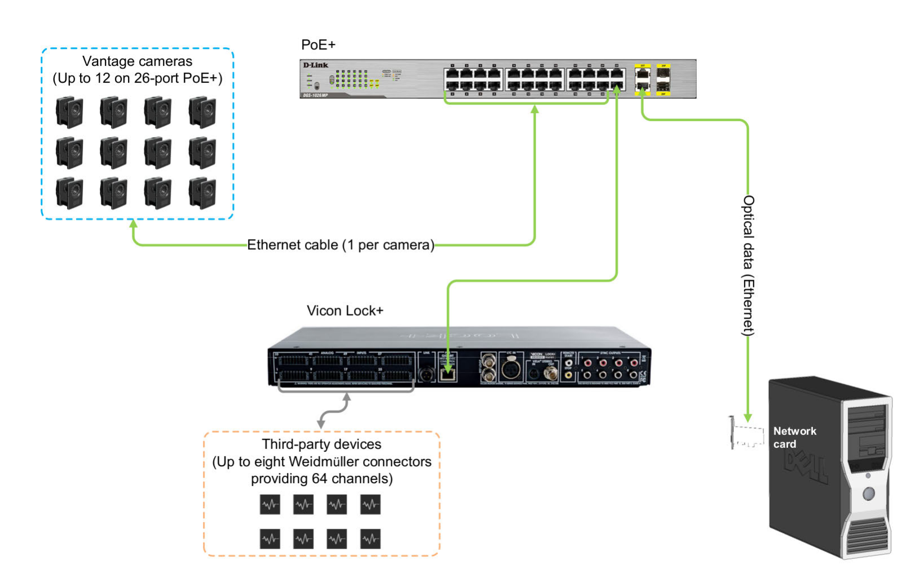
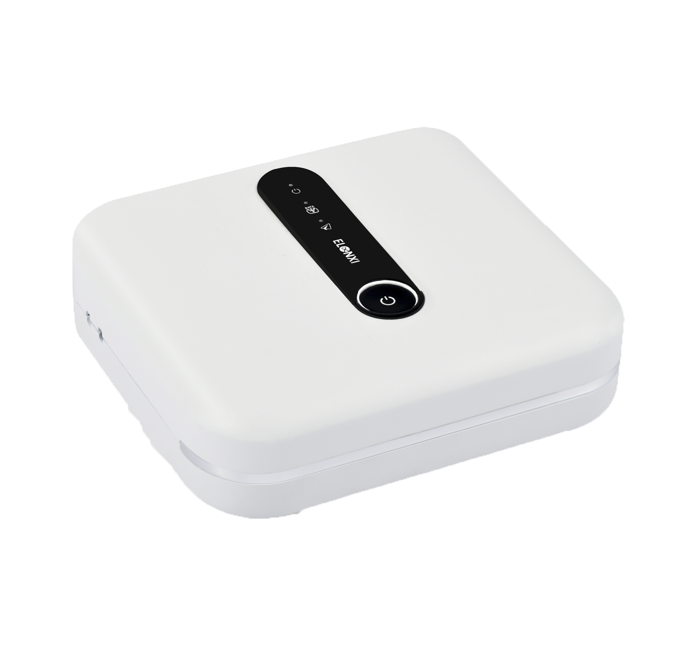

**Table of Contents**
{: #toc }
*  TOC
{:toc}

## Overview

　　As shown in Figure 1, the collection process involved a variety of locomotion activities, specifically: walking on level ground; uphill walking on 5◦ and 10◦ ramps; and downhill walking on 5° and 10° ramps. In terms of walking speeds, three different speeds were set: 0.5 m/s, 1.0 m/s, and 1.5 m/s. Moreover, the data collection conditions encompassed multiple scenarios, including ideal condition, muscle fatigue, electrode shifts, and inter-day differences. The experimental scene shows a participant equipped with all the devices: a motion capture system, a treadmill with embedded force plates, an sEMG system, and an AUS device.

    

Figure 1. Experiments were conducted in the biomechanics laboratory.

## Motion Capture System

　　3D kinematic trajectories of retro-reflective markers (14mm diameter) were recorded at 100 Hz using a motion capture system consisting of eight Vicon V5 cameras ([Vicon, Oxford, UK](https://www.vicon.com/)). For detailed specifications of the camera, please refer to the [V5 camera specifications](https://help.vicon.com/space/Vantage/15042553/V5+camera+specifications). The placement of markers followed the Vicon Plug-in Gait lower body model marker set, with an additional set of markers attached to the subjects to improve the fault tolerance of motion capture. These additional markers were used to fill in the missing data frames in the marker trajectories after the acquisition trials. A comprehensive description of the Plug-in Gait model, including the specifications of the kinematic and kinetic calculations, can be found in the [Vicon Nexus User Guide](../pdf/Vicon%20Nexus%20User%20Guide.pdf) and the [Plug-in Gait Reference Guide](../pdf/Plug-in%20Gait%20Reference%20Guide.pdf). The sEMG and AUS devices are synchronized for start/stop using high/low voltage control (5V/0V) through the Vicon Lock Lab port.

<table>
  <thead>
    <tr>
      <th colspan="2">Some technical specifications and performance indicators for the V5 camera</th>
    </tr>
  </thead>
  <tbody>
    <tr>
      <td>Component</td>
      <td>Specification</td>
    </tr>
    <tr>
      <td>Performance:</td>
      <td></td>
    </tr>
    <tr>
      <td>Maximum frame rate (fps) at full resolution</td>
      <td>420 <a href="https://help.vicon.com/space/Vantage/15042553/V5+camera+specifications#V5cameraspecifications-IncFrameRates">[1]</a></td>
    </tr>
    <tr>
      <td>Maximum frame rate (fps) at partial scan</td>
      <td>2,000 <a href="https://help.vicon.com/space/Vantage/15042553/V5+camera+specifications#V5cameraspecifications-IncFrameRates">[1]</a></td>
    </tr>
    <tr>
      <td>Frame rates (fps)</td>
      <td>30–2,000</td>
    </tr>
    <tr>
      <td>Sensor:</td>
      <td></td>
    </tr>
    <tr>
      <td>Sensor type</td>
      <td>CMOS</td>
    </tr>
    <tr>
      <td>Sensor resolution (pixels)</td>
      <td>2432H x 2048V</td>
    </tr>
    <tr>
      <td>Number of pixels</td>
      <td>4,980,736</td>
    </tr>
    <tr>
      <td>Pixel size</td>
      <td>4.5microns x 4.5microns</td>
    </tr>
    <tr>
      <td>Physical sensor size (mm)</td>
      <td>10.94mm (H) x 9.22mm (V), 14.31mm (Diagonal)</td>
    </tr>
    <tr>
      <td>Optical format</td>
      <td>2/3" and 1"</td>
    </tr>
    <tr>
      <td>Shutter type</td>
      <td>Global shutter <a href="https://help.vicon.com/space/Vantage/15042553/V5+camera+specifications#V5cameraspecifications-Shuttering">[2]</a></td>
    </tr>
    <tr>
      <td>Aspect ratio</td>
      <td>1:1</td>
    </tr>
  </tbody>
</table>

    

Vicon Lock+ in a Vicon Vantage system (System details correct at time of publication, but may now be superseded. For up-to-date information, visit the [Vicon website](https://www.vicon.com/) and search for PC specification).

　　

## Instrumented Treadmill

　　All walking trials were conducted on a fully instrumented treadmill ([Bertec, Columbus, Ohio](https://www.bertec.com/)). The treadmill features two independently controllable belts, each equipped with a force plate underneath to capture six-component force data at 1000 Hz. The treadmill incline was configured via software, while its start/stop functions, speed were controlled by a custom MATLAB code.

    

Bertec® Fully Instrumented Treadmill (download form [Bertec](https://www.bertec.com/))

　　

　　‍

## Surface Electromyography

　　A wireless EMG sensor system ([Ultium EMG, Noraxon, USA](https://www.noraxon.com/)) was used to record the muscle activity of the bilateral lower limbs at a sampling rate of 2000Hz. In the hardware setup of MR software (version 3.16, Noraxon, USA) , the high-pass and low-pass filter frequencies were configured to 20 Hz and 500 Hz, respectively. The Ultium EMG system was connected to the Vicon Lock Lab via a synchronization system (MyoSync, Noraxon, USA) to receive the synchronous square wave signal.

    

Noraxon’s Ultium EMG sensor system (download from [Noraxon Ultium EMG](https://www.noraxon.com/our-products/ultium-emg/))

　　

## Amplitude Mode Ultrasound

　　A wireless commercial four-channel amplitude mode ultrasound (AUS) device ([ELONXI, China](http://www.elonxi.cn)) was used to record AUS signals at a sampling frequency of 20Hz, with each frame containing 1000 samples. The frequency of the transducers was 5 MHz (9mm diameter, 11mm height), allowing a detection depth of up to 38.5 mm, which is sufficient for measuring contraction and extension changes within the muscle.

    

The four-channel amplitude mode ultrasound (AUS) device (download from [ELONXI](http://www.elonxi.cn/?list_17/74.html))

　　
