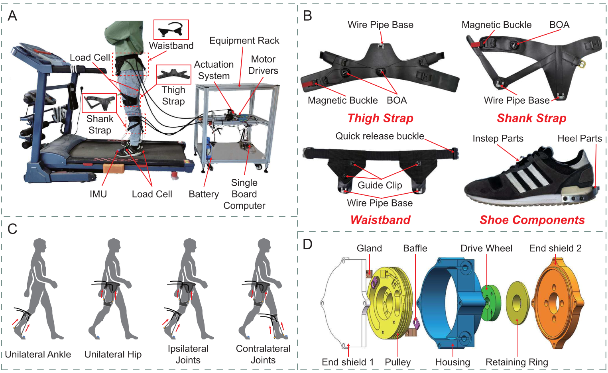

**Table of Contents**
{: #toc }
*  TOC
{:toc}

## Environment

Installation and Configuration Requirements:  
* [Biomechanics ToolKit (BTK)](https://biomechanical-toolkit.github.io/docs/): Required for parsing "*.c3d" files in MATLAB.
* [Jupyter Notebook](https://jupyter.org/): Needed to open and run "*.ipynb" scripts.
* [MATLAB 2022b](https://www.mathworks.com/products/matlab.html): Used for data visualization and processing.
* [Python 3.8](https://www.python.org/): Required for running Python-based scripts and models.

For MATLAB scripts, we use MATLAB (version 2022b).

For Python scripts, we use Visual Studio Vode (version 1.98.1).

The processed file is of *.mat format and can be opened using MATLAB (version 2022b, MathWorks, Natick, MA, USA).

To do so in your MATLAB workspace, use the load command and the full file extension: `load('you path of *.mat')`​.

You can also open the \*.mat files by double-clicking them directly. Please note that the files are large and may take some time to open, so please be patient.

## Load and Segment

This script is used to read and parse raw data from SourceData. The loading of all modal data and gait normalization are processed through the MATLAB script “scriptProcess.mlx”.

The parsing of "\*.c3d" files is achieved using the [Biomechanics ToolKit (BTK)](https://biomechanical-toolkit.github.io/docs/).

The specific introduction of this script is as follows:

* Readme:

  User guide for this script.

* Clear All:

  Initialize the working environment by clearing variables, closing windows, etc.

* Part1. Variable Definition:

  * Step1. For Path Definition:

    Define the storage path for the data.

  * Step2. For Data Processing:

    Define the variables needed during the file processing, including participant ID, device acquisition frequency, etc.

* Part2. Load Multimodal Data:

  Parse the data collected from each device in the 'SourceData' folder and save it to a unified '\*.mat' file.

  * Step1. Process Vicon Data

    * Load and Segmentation

      Parse the kinematics, dynamics, and gait events from the '\*.c3d' files in the 'Vicon' folder, perform gait normalization based on heel strike, and then save the data in '.mat' format to the 'ViconProcessed' folder.

  * Step2. Process ELONXI Data

    * Load and Segmentation

      Obtain the AUS data from the '\*.txt' files in the 'ELONXI' folder, merge the data from each channel, divide it based on gait events, and then save the data in '.mat' format to the 'ELONXIProcessed' folder.

    * Merge ELONXI to Vicon.mat (From ViconProcessed, save to DataMergeELONXI)

      Extract data from the 'ViconProcessed' folder and merge it with the AUS data. Save the merged data in '.mat' format to the 'DataMergeELONXI' folder.

  * Step3. Process Noraxon Data

    * Load and Segmentation

      Obtain the sEMG data from the '.mat' files in the 'Noraxon' folder, divide it based on gait events, and then save the data in '.mat' format to the 'NoraxonProcessed' folder.

    * Merge Noraxon to Vicon.mat (From DataMergeELONXI, save to DataProcessed)

      Extract data from the 'DataMergeELONXI' folder and merge it with the sEMG data. Save the merged data in '.mat' format to the 'DataProcessed' folder.

## Plot kinematics and kinetics

The MATLAB script "scriptPlot.mlx" can extract data for all participants from "ViconProcessed," save it as 'figData,' and plot the kinematics and kinetics.

The specific introduction of this script is as follows:

* Readme:

  User guide for this script

* Clear All:

  Initialize the working environment by clearing variables, closing windows, and other necessary tasks.

* Part1. Variable Definition:

  * Step1. For Path Definition:

    Define the storage path for the data.

  * Step2. For Figure Parameter:

    Define the parameters required for plotting the figures.

* Part2. Figures In Manuscript

  * Step1. Load 'figData':

    Load 'figData.mat' from "FigureData" folder for plotting figures.

  * Step2. Figures: Ideal Condition:

    Plot the kinematics and dynamics of all participants under different ramps and speeds in the ideal condition experiment.

## Joint Angle Regression

  The script described below is available in the Kaggle-Data Card:
  <a href="https://kaggle.com/datasets/98d67c253a7c820668aed0690cae20343481b8f8f8e0dafbe93b0c76d91f0ce6"
     target="_blank" rel="noopener noreferrer">
    Code/PythonProcess/demoRegression.ipynb
  </a>

* Readme
  
  User guide for this code.

* Part1. Import Module
  
  Import the necessary libraries and custom modules for data processing, modeling, and plotting.

* Part2. Definition

  * Step1. Define Path:

    Define the paths for data, results, H5 files, and image storage, and create the corresponding folders.

  * Step2. Define Variables:

    Define the variables needed in the data processing and model fitting processes.

* Part3. ML Model

  Process the data, including loading, preprocessing, feature extraction, etc., and train and evaluate different machine learning models to predict joint angles.

* Part4. Analysis Results

  Calculate the metrics for all participants and plot the mean and standard deviation of the corresponding metrics.

  * Step1. Calculate Results:

    Calculate the average and standard deviation of the results for all participants.

  * Step2. Fig: RMSE-Bar:

    This step creates a bar plot to visualize the RMSE (Root Mean Squared Error) of joint angles for different models and joints.

## Gait Phase Classification

  The script described below is available in the Kaggle-Data Card:
  <a href="https://kaggle.com/datasets/98d67c253a7c820668aed0690cae20343481b8f8f8e0dafbe93b0c76d91f0ce6"
     target="_blank" rel="noopener noreferrer">
    Code/PythonProcess/demoClassification.ipynb
  </a>

* Readme
  
  User guide for this code.

* Part1. Import Module
  
  Import the necessary libraries and custom modules for data processing, modeling, and plotting.

* Part2. Definition

  * Step1. Define Path:

    Define the paths for data, results, H5 files, and image storage, and create the corresponding folders.

  * Step2. Define Variables:

    Define the variables needed in the data processing and model fitting processes.

* Part3. ML Model

  Process the data, including loading, preprocessing, feature extraction, etc., and train and evaluate different machine learning models to predict joint angles.

* Part4. Analysis Results

  Calculate the metrics for all participants and plot the mean and standard deviation of the corresponding metrics.

  * Step1. Calculate Results:

    Calculate the average and standard deviation of the results for all participants.

  * Step2. Fig: Accuracy-Bar:

    This step creates a bar plot to visualize the classification accuracy of gait phases for different models.

## End-to-End Control

  The script described below is available in the Kaggle-Data Card:
  <a href="https://kaggle.com/datasets/98d67c253a7c820668aed0690cae20343481b8f8f8e0dafbe93b0c76d91f0ce6"
     target="_blank" rel="noopener noreferrer">
    Code/control-demo/demo.ipynb
  </a>

* Readme
  
  User guide for this notebook. It explains the end-to-end workflow of the control demo, including data loading, model selection, export to ONNX, conversion to TensorRT, and inference/metric reporting.

* Part1. Import Module
  
  Import required libraries and custom modules for model definition (TCN), data loading (H5), evaluation metrics, and deployment utilities (ONNX/TensorRT).

* Part2. Arguments / Configuration
  
  Define and override runtime arguments used throughout the demo, such as device type (CPU/CUDA), sequence/window length, batch size, input/output definitions (e.g., hip angle → hip moment), and paths to data/models/export folders.

* Part3. Data Utilities
  
  Provide helper functions for this demo, including creating output folders, reading trial-level HDF5 files, converting continuous time series into fixed-length windows for TCN inference, and constructing batched DataLoaders for evaluation.

* Part4. Convert Selected Models (PyTorch → ONNX → TensorRT)
  
  Convert pretrained PyTorch checkpoints into deployment artifacts to reduce inference latency on embedded hardware.
  
  * Step1. Select Models and Define Export Paths:
    Specify which pretrained models (e.g., per speed/mode) will be used, and define output folders for onnx/, onnx_sim/, and trt/ artifacts.

  * Step2. Export ONNX and Build TensorRT Engines:
    Export each model to ONNX, optionally simplify the ONNX graph, and build a TensorRT engine for efficient runtime inference.

* Part5. Inference by Torch

  Run baseline inference using the PyTorch model on a selected trial to verify correctness and establish a reference for accuracy and latency.

  * Step1. Load Trial Data and Windowing:

    Load hip angle (input) and hip moment (label) from H5, then slice the sequence into fixed-length windows aligned with the model’s expected input shape.

  * Step2. Batched Inference and Metrics:

   Perform batched PyTorch inference, aggregate predictions, and compute evaluation metrics (e.g., RMSE and R²) and optional plots.

* Part6. Inference by TensorRT

  Run accelerated inference using TensorRT engines and compare results with the PyTorch baseline.

  * Step1. Load TensorRT Engine and Allocate Buffers:

   Load the .trt engine, create the execution context, and allocate host/device buffers for inputs/outputs.

  * Step2. Run TensorRT Inference and Compare:
  
   Execute TensorRT inference batch-by-batch, compute RMSE/R², measure inference latency, and compare performance against PyTorch.

  <strong>The following text provides a detailed description of the end-to-end control framework.</strong>

  To validate the usability of the proposed K2MUSE dataset for robotic control, we conducted assistive experiments
  using a soft exoskeleton previously developed by our team
  <a href="#ref-zhang2025" id="cite-zhang2025">[1]</a>.
  All experiments implemented hip-joint assistance, serving as a control example to demonstrate the effectiveness
  and practical applicability of K2MUSE in control-oriented scenarios. In addition, the exoskeleton platform was equipped
  with extended Bowden cables and self-locking casters, enabling convenient mobility while maintaining stability when needed,
  thereby supporting assistive experiments in outdoor environments. An overview of the proposed soft exoskeleton is shown below.

    

Overview of (a) the soft exoskeleton, (b) wearable suit, (c) modular assistance confi gurations, and (d) bidirectional pulley actuator.

  Following Molina-Lozano et al. (2024a)
  <a href="#ref-molinaro2024" id="cite-molinaro2024">[2]</a>,
  we adopted an end-to-end control framework in which a deep learning model estimates the wearer’s hip joint moment online
  using only the real-time hip joint angle.
  The estimated moment is used directly as the control command to provide natural assistance during walking.

  Specifically, we trained a temporal convolutional network (TCN) using kinematic and kinetic measurements collected from multiple ambulation tasks
  in the K2MUSE dataset.
  The trained model was then deployed on an embedded processor (Jetson Orin NX, NVIDIA) for online inference.
  The hip joint angle was measured by an encoder in real time and provided as input to the network.
  To reduce inference latency, the pretrained model was converted into a TensorRT engine for deployment.

  Because our goal is to provide a reproducible demo, we did not perform extensive hyperparameter optimization during training on K2MUSE. For each subject and each walking mode, we conducted 5-fold cross-validation using the five recorded trials, and we selected the model with the best test performance as the final model for that mode. We then deployed the best models across all modes as TensorRT engines for inference, and we averaged their outputs to obtain the instantaneous joint moment estimate used for that subject.

  The estimated joint moment was subsequently scaled, temporally adjusted, and filtered,
  and it was mapped to the assistive input force profile of the soft exoskeleton.
  At the low-level control layer, an admittance controller combined with a PD controller generated motor velocity commands to deliver the assistance, consistent with our previous work
  <a href="#ref-zhang2025" id="cite-zhang2025">[1]</a>.

## Known Issues

* The Nexus software detected incorrect gait events for some experiments. These errors were manually corrected using the [open-source software Mokka](https://biomechanical-toolkit.github.io/mokka/index.html).
* Some trials from certain participants contained defective data due to an investigator error, which was later re-collected.
* Some participants have insufficient AUS data frames for certain trials, which results in empty AUS data for some strides in the NormalizedData.

<h3>References</h3>
<ol>
  <li id="ref-zhang2025">
    Zhang B, Jiang W, Tan X, et al. <i>Modular Soft Exoskeleton Design and Control for Assisting Movements in Multiple Lower Limb Joint Configurations</i>.
    IEEE Transactions on Automation Science and Engineering, 2025.
    <a href="#cite-zhang2025" aria-label="Back to citation">↩</a>
  </li>
s  <li id="ref-molinaro2024">
    Molinaro D D, Kang I, Young A J.
    <i>Estimating human joint moments unifies exoskeleton control, reducing user effort</i>.
    Science Robotics, 2024, 9(88): eadi8852.
    <a href="#cite-molinaro2024" aria-label="Back to citation">↩</a>
  </li>
</ol>